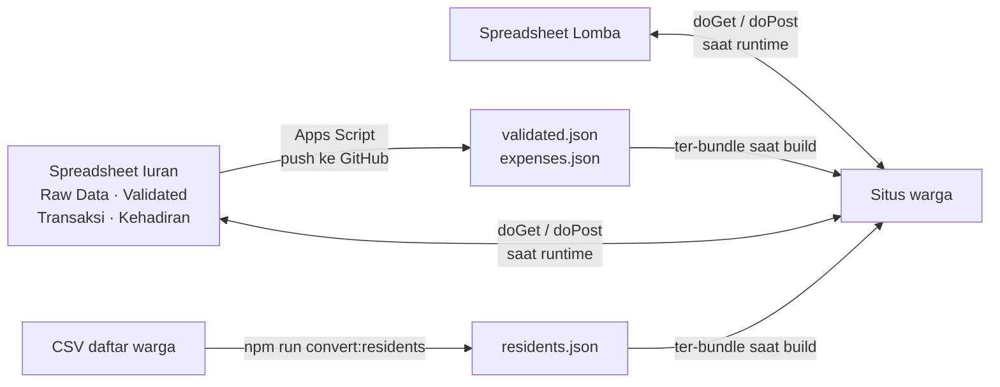

# Catat Uang Warga

Situs transparansi iuran warga untuk perumahan, cluster, atau RT/RW.
Warga bisa cek sendiri status pembayarannya, lihat ke mana uang kas dipakai,
dan daftar acara warga — tanpa perlu tanya bendahara satu per satu.

Tanpa server, tanpa biaya bulanan. Datanya dari Google Sheet, situsnya di-hosting
gratis di Netlify.

```
npm install
npm run setup     # isi nama perumahan, iuran, blok, rekening
npm run dev       # buka http://localhost:5173
```

Aplikasi sudah berisi **data demo** begitu di-install, jadi bisa langsung dilihat
tampilannya sebelum data asli dimasukkan.

---

## Fitur

**Iuran & keuangan**
- Cek status pembayaran per rumah — pilih blok + nomor rumah
- Riwayat transaksi, progress bar tahunan, penanda lunas/belum, dan saldo kelebihan bayar
- Link permanen per rumah (`/warga/A/1`) yang bisa di-share ke warga bersangkutan
- Kartu "Cara Bayar" berisi rekening, form konfirmasi, dan kontak pengurus
- Leaderboard blok & rumah berdasarkan persentase terkumpul
- Halaman pengeluaran: rutin + insidental, dengan filter kategori
- Generator pesan broadcast WhatsApp untuk laporan iuran maupun pengeluaran

**Acara warga**
- Form RSVP acara + halaman rekap siapa yang sudah/belum konfirmasi
- Form pendaftaran lomba (satu submit per rumah, banyak peserta) + rekap per lomba,
  per rumah, dan per kelompok umur

**Teknis**
- Mobile-first, dipakai warga langsung dari HP
- Semua identitas (nama perumahan, nominal iuran, blok, rekening, kontak) ada di
  **satu file config** — tidak ada yang hardcode di dalam komponen
- Fitur bisa dimatikan satu-satu lewat config kalau tidak dipakai
- Analytics opsional (Umami, cookieless)

## Butuh apa saja

| Kebutuhan | Keterangan |
|---|---|
| Node.js 20+ | Untuk menjalankan & build |
| Akun GitHub | Menyimpan kode + memicu deploy otomatis |
| Akun Netlify (gratis) | Hosting situs |
| Akun Google | Google Sheet sebagai sumber data (opsional tapi disarankan) |

## Dokumentasi

| Dokumen | Isinya |
|---|---|
| [docs/INSTALASI.md](docs/INSTALASI.md) | **Mulai dari sini.** Dari download sampai situs online, langkah demi langkah |
| [docs/KONFIGURASI.md](docs/KONFIGURASI.md) | Penjelasan tiap field di `site.config.js` dan environment variable |
| [docs/PANDUAN-PENGURUS.md](docs/PANDUAN-PENGURUS.md) | Cara pakai harian untuk bendahara/pengurus — tanpa menyentuh kode |
| [docs/google-apps-script-setup.md](docs/google-apps-script-setup.md) | Menghubungkan Google Sheet ke situs (update data otomatis) |
| [docs/attendance-apps-script.md](docs/attendance-apps-script.md) | Setup form RSVP acara |
| [docs/lomba-apps-script.md](docs/lomba-apps-script.md) | Setup form pendaftaran lomba |
| [docs/analytics.md](docs/analytics.md) | Memasang Umami analytics (opsional) |

## Halaman

| Path | Keterangan | Bisa dimatikan? |
|------|-----------|---|
| `/` | Cek status pembayaran per rumah | — |
| `/warga/:blok/:nomorRumah` | Dashboard satu rumah (link permanen) | — |
| `/leaderboard` | Ranking blok & rumah | ✅ |
| `/pengeluaran` | Transparansi pengeluaran | ✅ |
| `/broadcast` | Generator pesan WhatsApp | ✅ |
| `/kehadiran` · `/rekap-kehadiran` | RSVP acara + rekapnya | ✅ |
| `/lomba` · `/rekap-lomba` | Pendaftaran lomba + rekapnya | ✅ |

Halaman yang fiturnya dimatikan otomatis dialihkan ke halaman depan.

## Konfigurasi

Semua identitas ada di [`src/config/site.config.js`](src/config/site.config.js):

```js
export const siteConfig = {
  perumahan: { nama: 'Perumahan Contoh Asri', url: 'https://…' },
  iuran:     { label: 'IPL', tahun: 2026, nominalBulanan: 250000, bulanPerTahun: 12 },
  rumah:     { blok: ['A','B','C','D','E','F'], nomorMin: 1, nomorMax: 15 },
  pembayaran:{ bank: 'Bank Contoh', nomorRekening: '…', atasNama: '…' },
  kontak:    { namaPengurus: 'Pengurus', whatsapp: '628…' },
  fitur:     { leaderboard: true, pengeluaran: true, broadcast: true, kehadiran: true, lomba: true },
  acara:     { judul: 'Kumpul Warga', tanggalLabel: '…', waktuLabel: '…', tempatLabel: '…' },
}
```

Warna tiap blok dibagikan otomatis, jadi jumlah blok bebas — 2 blok atau 12 blok
sama-sama jalan. Detail tiap field: [docs/KONFIGURASI.md](docs/KONFIGURASI.md).

## Alur data

Data iuran & pengeluaran ikut ter-*bundle* saat build (perlu deploy ulang tiap
update — dan itu otomatis), sedangkan data acara dibaca langsung dari spreadsheet
setiap halaman dibuka.



## Perintah

```bash
npm run setup        # wizard konfigurasi (menulis ulang site.config.js)
npm run dev          # server pengembangan
npm run build        # build produksi ke dist/
npm run preview      # cek hasil build secara lokal
npm run lint         # eslint

npm run demo:seed    # isi ulang data demo (menimpa data di src/data/)
npm run convert:residents   # CSV daftar warga  → src/data/residents.json
npm run convert:validated   # CSV pembayaran    → src/data/validated.json
npm run convert:expenses    # CSV pengeluaran   → src/data/expenses.json
```

## Tech stack

React 19 · Vite 6 · Tailwind CSS v4 · react-router-dom v7 · lucide-react.
Tanpa backend sendiri — data statis (JSON) + Google Apps Script untuk form acara.

## Lisensi

Lihat [LICENSE.md](LICENSE.md). Ringkasnya: satu pembelian berlaku untuk satu
perumahan/komunitas, boleh dimodifikasi sesuka hati, tapi tidak untuk dijual ulang.
