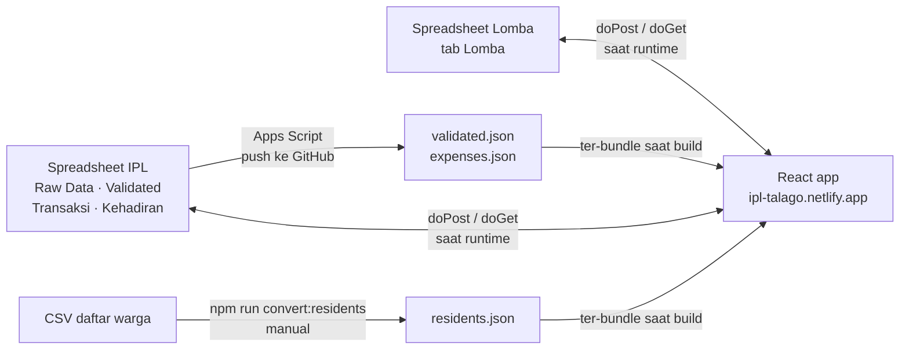
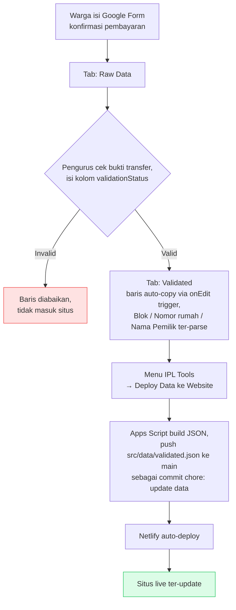
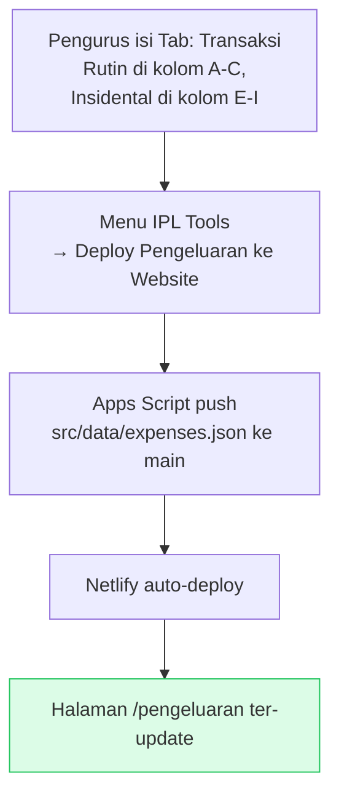

# Catat Uang Warga

Web app warga D'Talago Regency untuk mengecek status pembayaran IPL (Iuran Pengelolaan Lingkungan) 2026, transparansi pengeluaran, sampai pendaftaran acara warga.

🌐 **Live:** https://ipl-talago.netlify.app

## Fitur

**IPL & Keuangan**
- Cek status pembayaran per rumah (blok + nomor)
- Riwayat transaksi lengkap + indikator lunas / belum lunas
- Progress bar pembayaran tahunan & info kelebihan bayar
- Link permanen per rumah (`/warga/A/1`) — bisa di-share via tombol Share
- Panduan pembayaran (rekening, form konfirmasi, kontak pengurus) saat data belum ditemukan
- Leaderboard blok & rumah (ranking berdasarkan % terkumpul)
- Transparansi pengeluaran rutin & insidental, dengan filter kategori
- Generate pesan broadcast WhatsApp untuk laporan IPL maupun pengeluaran

**Acara Warga**
- Form RSVP Kumpul Warga + halaman rekap siapa yang sudah/belum konfirmasi
- Form pendaftaran Lomba 17-an (satu submit per rumah, banyak peserta)
- Rekap lomba: peserta per lomba (bisa dikelompokkan per umur), per rumah, daftar rumah yang belum ikut, dan rundown pentas seni

**Lainnya**
- Mobile-first, responsive
- Analytics Umami (cookieless) — lihat [`docs/analytics.md`](docs/analytics.md)

## Tech Stack

- React 19 + Vite
- Tailwind CSS v4
- lucide-react
- react-router-dom v7
- Tanpa backend — data IPL statis (JSON), data acara lewat Google Apps Script

## Alur Data

Ada dua mekanisme yang berbeda: data IPL & pengeluaran ikut ter-*bundle* saat build
(statis, perlu deploy ulang tiap update), sedangkan data acara dibaca real-time dari
spreadsheet setiap halaman dibuka.



## Halaman

| Path | Keterangan |
|------|-----------|
| `/` | Cek status pembayaran per rumah |
| `/warga/:blok/:nomorRumah` | Dashboard satu rumah (link permanen, bisa di-share) |
| `/leaderboard` | Ranking blok & rumah |
| `/broadcast` | Generate pesan WhatsApp laporan IPL |
| `/pengeluaran` | Transparansi pengeluaran + filter kategori |
| `/kehadiran` | Form RSVP acara Kumpul Warga |
| `/rekap-kehadiran` | Rekap RSVP per blok (sudah/belum konfirmasi) |
| `/lomba` | Pendaftaran Lomba 17-an |
| `/rekap-lomba` | Rekap peserta lomba per lomba, per rumah, per umur |

## Menjalankan Lokal

```bash
npm install
cp .env.example .env.local   # wajib — lihat catatan di bawah
npm run dev
```

> ⚠️ Tanpa `.env.local`, `index.html` menyisakan placeholder `%VITE_UMAMI_SCRIPT_URL%`
> yang membuat dev server balas **500 (`URI malformed`)**. Isi boleh kosong, filenya
> yang harus ada.

### Environment Variables

| Variable | Dipakai untuk | Wajib? |
|---|---|---|
| `VITE_UMAMI_SCRIPT_URL` | Script URL Umami analytics | Boleh kosong |
| `VITE_UMAMI_WEBSITE_ID` | Website ID Umami | Boleh kosong |
| `VITE_ATTENDANCE_ENDPOINT` | Web App Apps Script untuk `/kehadiran` & `/rekap-kehadiran` | Untuk fitur kehadiran |
| `VITE_LOMBA_ENDPOINT` | Web App Apps Script untuk `/lomba` & `/rekap-lomba` | Untuk fitur lomba — **tanpa fallback**, kalau kosong form menolak submit |

Di production, set semuanya di **Netlify → Site settings → Environment variables**.

## Google Apps Script

Form kehadiran dan form lomba menulis ke **dua spreadsheet terpisah** dengan dua
project Apps Script dan dua Web App URL berbeda (satu project cuma bisa punya satu
`doPost`/`doGet`, jadi jangan digabung).

| Spreadsheet | Script | Env var | Panduan |
|---|---|---|---|
| IPL (tab Raw Data, Validated, Transaksi, Kehadiran) | `scripts/google-apps-script/Code.gs` | `VITE_ATTENDANCE_ENDPOINT` | [`docs/attendance-apps-script.md`](docs/attendance-apps-script.md) |
| Lomba (tab Lomba) | `scripts/google-apps-script/Lomba.gs` | `VITE_LOMBA_ENDPOINT` | [`docs/lomba-apps-script.md`](docs/lomba-apps-script.md) |

Setup awal sheet IPL ada di [`docs/google-apps-script-setup.md`](docs/google-apps-script-setup.md).

> Penulisan ke sheet bersifat posisional: urutan `LOMBA_KEYS` di `Lomba.gs` harus
> sama dengan `LOMBA_LIST` di `src/data/lomba.js`.

## Update Data

Data IPL & pengeluaran ada di `src/data/validated.json` dan `src/data/expenses.json`.
**Update sehari-hari tidak perlu buka code sama sekali** — cukup dari Google Sheet.
Apps Script yang commit sendiri ke GitHub, lalu Netlify auto-deploy.

### Alur pengurus: update data pembayaran



Langkah detailnya:

1. **Warga isi form konfirmasi pembayaran** → baris masuk ke tab **Raw Data**.
2. **Pengurus review** bukti transfer, lalu isi kolom `validationStatus` dengan
   `Valid` (atau `Invalid` kalau ditolak).
3. Baris yang di-set `Valid` **otomatis ter-copy** ke tab **Validated**, lengkap
   dengan kolom Blok, Nomor rumah, dan Nama Pemilik hasil parsing dari
   `"E 5. Nama Pemilik"`.
4. Setelah selesai review, klik menu **IPL Tools → Deploy Data ke Website** di
   spreadsheet, konfirmasi **Yes**. Muncul toast berisi jumlah record yang ter-deploy.
5. Apps Script build JSON-nya dan push ke `main` sebagai commit `chore: update data`.
   Netlify mendeteksi push dan deploy ulang — situs live update dalam beberapa menit.

### Alur pengurus: update pengeluaran



1. Isi tab **Transaksi** — tabel Rutin di kolom A–C (Keterangan, Masuk, Keluar),
   tabel Insidental di kolom E–I (Keterangan, Masuk, Keluar, Tanggal, Kategori).
2. Klik menu **IPL Tools → Deploy Pengeluaran ke Website**, konfirmasi **Yes**.
3. Apps Script push `src/data/expenses.json` ke `main` → Netlify deploy ulang.

> Menu **IPL Tools** hanya muncul kalau Apps Script sudah ter-setup di spreadsheet
> (Script Properties `GITHUB_TOKEN` + `GITHUB_REPO`, dan installable onEdit trigger).
> Panduan lengkap + troubleshooting ada di
> [`docs/google-apps-script-setup.md`](docs/google-apps-script-setup.md).

### Fallback: update manual lewat CSV

Dipakai kalau Apps Script bermasalah, atau untuk data yang belum ada menunya
(daftar warga masih manual):

```bash
npm run convert:validated   # raw_data/IPL 2026 - Validated.csv  → src/data/validated.json
npm run convert:expenses    # raw_data/IPL 2026 - Pengeluaran Rutin.csv → src/data/expenses.json
npm run convert:residents   # CSV daftar warga → src/data/residents.json
```

Download dulu CSV-nya dari Google Sheets ke `raw_data/`, jalankan script-nya,
lalu commit hasilnya.

> `raw_data/` di-gitignore karena mengandung data sensitif (email, bukti transfer).

### Data acara (kehadiran & lomba)

Tidak perlu deploy sama sekali. Halaman `/rekap-kehadiran` dan `/rekap-lomba`
membaca langsung dari spreadsheet lewat Apps Script `doGet` setiap kali dibuka,
jadi data selalu real-time.

## Build & Deploy

```bash
npm run lint    # eslint
npm run build   # output ke dist/
npm run preview # preview hasil build
```

Deploy otomatis ke Netlify saat push ke `main`.
