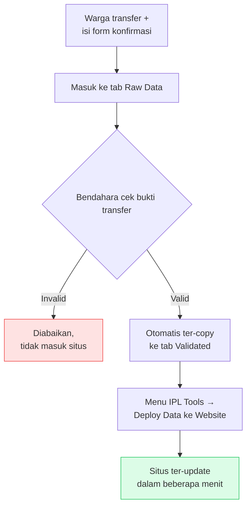

# Panduan Pengurus

Panduan pemakaian sehari-hari untuk **bendahara dan pengurus** — tidak perlu
membuka kode sama sekali.

> Panduan ini mengasumsikan situs sudah online dan Google Apps Script sudah
> tersambung. Kalau belum, kerjakan [INSTALASI.md](INSTALASI.md) lebih dulu.

- [Sekilas: siapa melakukan apa](#sekilas-siapa-melakukan-apa)
- [Mencatat pembayaran warga](#mencatat-pembayaran-warga)
- [Mencatat pengeluaran](#mencatat-pengeluaran)
- [Mengirim laporan ke grup WhatsApp](#mengirim-laporan-ke-grup-whatsapp)
- [Menambah atau mengganti data warga](#menambah-atau-mengganti-data-warga)
- [Acara warga & lomba](#acara-warga--lomba)
- [Menjawab pertanyaan warga](#menjawab-pertanyaan-warga)
- [Rutinitas yang disarankan](#rutinitas-yang-disarankan)

---

## Sekilas: siapa melakukan apa

| Peran | Yang dikerjakan | Di mana |
|---|---|---|
| Warga | Transfer, isi form konfirmasi, cek status sendiri | Situs + WhatsApp |
| Bendahara | Verifikasi bukti transfer, catat pengeluaran | Google Sheet |
| Pengurus | Klik menu deploy, sebar laporan | Google Sheet + situs |

Yang perlu diingat cuma satu hal: **data pembayaran & pengeluaran baru muncul di
situs setelah menu "Deploy" ditekan.** Data acara (kehadiran & lomba) tidak perlu
deploy — langsung real-time.

---

## Mencatat pembayaran warga

Langkah detail:

1. **Warga mengisi form konfirmasi** setelah transfer. Barisnya otomatis masuk ke
   tab **Raw Data**.

2. **Cek bukti transfernya**, lalu isi kolom `validationStatus`:
   - `Valid` → pembayaran diakui
   - `Invalid` → ditolak, tidak akan muncul di situs

3. Baris ber-status `Valid` **otomatis ter-copy** ke tab **Validated**, lengkap
   dengan blok, nomor rumah, dan nama pemilik yang sudah terpisah rapi.

4. Setelah selesai memverifikasi, klik menu **IPL Tools → Deploy Data ke Website**
   di bagian atas spreadsheet, lalu konfirmasi **Yes**. Akan muncul notifikasi
   berisi jumlah data yang terkirim.

5. Situs update sendiri dalam 1–3 menit. Buka situsnya dan cek satu rumah untuk
   memastikan.

> **Warga transfer tanpa mengisi form?** Tambahkan barisnya secara manual di tab
> **Validated** (isi kolom yang sama seperti baris lain), lalu tetap jalankan
> **Deploy Data ke Website**.

> **Salah catat?** Perbaiki atau hapus barisnya di tab **Validated**, lalu deploy
> lagi. Situs selalu mengikuti isi tab tersebut apa adanya.

---

## Mencatat pengeluaran

1. Buka tab **Transaksi**:
   - **Kolom A–C** — pengeluaran rutin: Keterangan, Masuk, Keluar
     (mis. gaji security bulanan, kebersihan)
   - **Kolom E–I** — pengeluaran insidental: Keterangan, Masuk, Keluar, Tanggal, Kategori
     (mis. perbaikan lampu jalan, konsumsi rapat)

2. Isi **Kategori** dengan konsisten (`Fasilitas Umum`, `Kegiatan Warga`, `Sosial`, …)
   — kategori inilah yang jadi filter di halaman pengeluaran, dan yang diringkas
   di pesan broadcast.

3. Klik **IPL Tools → Deploy Pengeluaran ke Website**, konfirmasi **Yes**.

Total masuk, total keluar, dan sisa anggaran dihitung otomatis — tidak perlu
diisi manual.

---

## Mengirim laporan ke grup WhatsApp

Situs bisa menyusun pesannya untukmu.

**Laporan iuran:**
1. Buka halaman `/broadcast` di situs
2. Cek preview pesannya
3. Klik **Salin** → tempel di grup WhatsApp

Isinya: persentase terkumpul per blok, daftar rumah yang sudah lunas, yang baru
sebagian, dan yang belum bayar sama sekali.

**Laporan pengeluaran:**
Buka `/pengeluaran`, klik tombol salin di bagian atas. Isinya ringkasan kas +
rincian per kategori.

> **Menagih warga tertentu.** Buka rumahnya di situs (`/warga/A/1`), klik tombol
> **Bagikan**, lalu kirim linknya ke warga bersangkutan lewat japri. Warga
> langsung melihat rincian pembayarannya sendiri — lebih enak daripada menyebut
> nama di grup.

---

## Menambah atau mengganti data warga

Daftar warga (`residents.json`) dipakai untuk menghitung berapa rumah yang
seharusnya membayar — termasuk rumah yang **belum pernah** bayar sekalipun.
Jadi daftar ini harus lengkap, bukan hanya yang sudah membayar.

Untuk warga baru pindah atau rumah berganti pemilik, mintakan bantuan ke orang
yang meng-install situs ini; datanya diperbarui lewat perintah
`npm run convert:residents`. Prosesnya beberapa menit saja.

---

## Acara warga & lomba

Bagian ini **tidak perlu deploy** — halaman rekap membaca langsung dari
spreadsheet setiap kali dibuka.

**Sebelum acara:**
1. Perbarui detail acara (judul, tanggal, jam, tempat) — mintakan ke pemasang situs,
   atau ubah sendiri di `src/config/site.config.js` bagian `acara`
2. Sebar link `/kehadiran` ke grup warga
3. Pantau di `/rekap-kehadiran` — terlihat per blok siapa yang sudah dan belum konfirmasi
4. Klik tombol **Bagikan** di halaman rekap untuk mengirim pengingat ke grup

**Lomba:**
1. Sebar link `/lomba`. Satu rumah mengisi sekali untuk semua anggota keluarga
2. Pantau di `/rekap-lomba`: peserta per lomba, per rumah, rumah yang belum daftar,
   serta rundown pentas seni
3. Untuk cetak/print, halaman rekap bisa langsung di-print dari browser
4. Setelah lewat batas pendaftaran, form otomatis menutup sendiri

---

## Menjawab pertanyaan warga

**"Saya sudah transfer tapi belum muncul."**
Cek tab **Raw Data**. Kalau barisnya ada tapi belum diverifikasi → verifikasi lalu
deploy. Kalau barisnya tidak ada → warga belum mengisi form konfirmasi; minta
buktinya, catat manual di tab **Validated**, lalu deploy.

**"Nomor rumah saya tidak ditemukan."**
Berarti rumah itu belum punya transaksi tercatat. Yang muncul adalah kartu cara
bayar — itu sudah sesuai desain. Kalau warga merasa sudah pernah bayar, cek
riwayat di spreadsheet.

**"Kenapa nominal saya berbeda?"**
Buka `/warga/{blok}/{nomor}`; semua transaksi tercatat lengkap dengan tanggal.
Cocokkan dengan tab **Validated**.

**"Kelebihan bayar saya bagaimana?"**
Otomatis tampil sebagai saldo di dashboard warga, lengkap dengan perkiraan berapa
bulan setara untuk periode berikutnya.

---

## Rutinitas yang disarankan

| Kapan | Yang dikerjakan |
|---|---|
| Setiap ada transfer masuk | Verifikasi di tab Raw Data |
| Seminggu sekali | **Deploy Data ke Website**, lalu sebar laporan `/broadcast` |
| Setiap ada pengeluaran | Catat di tab Transaksi |
| Sebulan sekali | **Deploy Pengeluaran ke Website**, sebar laporan pengeluaran |
| Awal tahun | Ganti `tahun` di config, arsipkan data tahun lalu |

> **Menu "IPL Tools" tidak muncul?** Berarti Apps Script belum ter-setup di
> spreadsheet itu, atau ter-setup di spreadsheet yang salah. Lihat
> [google-apps-script-setup.md](google-apps-script-setup.md).
